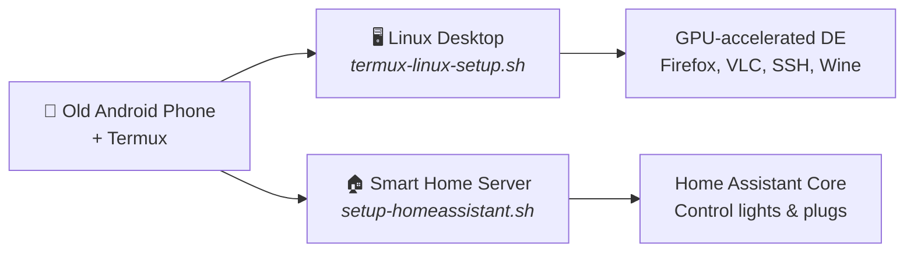

# Repurpose Your Old Android Phone

Turn any old Android phone into a **Linux desktop** or a **smart home server** — no PC, no root, no cloud. Just [Termux](https://termux.dev).

> Created to accompany a YouTube video walkthrough. Timestamps are referenced in the video description.



### Pick your path

| | Linux Desktop | Smart Home Server |
|---|---|---|
| **What** | Full GUI desktop environment on your phone | Home Assistant hub that controls WiFi devices |
| **Use cases** | Learning Linux, Python dev, SSH server, web browsing, media | Control smart lights/plugs, automation, dashboards |
| **Script** | `bash termux-linux-setup.sh` | `bash setup-homeassistant.sh` |
| **Time** | 10–30 min | 15–45 min |
| **Jump to** | [Desktop setup](#installation) | [Home Assistant setup](#home-assistant--smart-home-server) |

You can run both on the same phone — they don't conflict.

You can follow along the YouTube video here: https://youtu.be/tYm2rQpkOcg?si=moV59vk5J7B4h46N


---

## Requirements

### Hardware
- Android phone with an **arm64 (64-bit)** processor
- **3 GB+ RAM** recommended (4 GB+ for KDE Plasma)
- **5–10 GB** of free storage (more if you install Wine)
- A **Qualcomm Snapdragon** chip is ideal — it enables the best GPU acceleration (Turnip/Adreno). The script works on Mali/other GPUs too but performance will be lighter.

### Software
| App | Where to Get It |
|---|---|
| **Termux** | [F-Droid](https://f-droid.org/en/packages/com.termux/) — **do not use the Play Store version, it is outdated** |
| **Termux-X11** | [GitHub Releases](https://github.com/termux/termux-x11/releases) — download the latest `.apk` |

> **Note on rooting / custom ROMs:** This script works on stock Android too. The video demonstrates it running on **LineageOS** on a OnePlus 5T. Rooting is not required by the script itself.

---

## Desktop Environments — Which One to Choose?

| # | Desktop | Best For | Resource Usage |
|---|---|---|---|
| 1 | **XFCE4** *(default)* | Most users. Fast, customizable, macOS-style dock | Low–Medium |
| 2 | **LXQt** | Old or low-RAM phones (2–3 GB) | Very Low |
| 3 | **MATE** | Classic desktop feel | Medium |
| 4 | **KDE Plasma** | Powerful phones only — Windows 11 style | High |

If you're unsure, go with **XFCE4**.

---

## Installation

### Step 1 — Install required apps

Install **Termux** from F-Droid and **Termux-X11** from GitHub (links above). Grant both apps any permissions they request.

### Step 2 — Pre-upgrade Termux (important — do this first)

Open Termux and run:

```bash
termux-wake-lock
pkg upgrade -y
```

The `termux-wake-lock` command keeps Termux alive when your screen turns off — without it, Android can kill the process mid-install. The `pkg upgrade` brings your base system up to date before the script runs, preventing a known crash involving `libpcre` and `libandroid-selinux`.

### Step 3 — Download and run the script

```bash
curl -O https://raw.githubusercontent.com/mayukh4/linux-anroid/main/termux-linux-setup.sh
chmod +x termux-linux-setup.sh
bash termux-linux-setup.sh
```

The script will ask you to choose a desktop environment and whether you want Wine. Everything else is automatic.

Installation takes **10–30 minutes** depending on your internet speed. A full log is saved to `~/termux-setup.log` if anything goes wrong.

### Step 4 — Start your desktop

```bash
bash ~/start-linux.sh
```

Then **open the Termux-X11 app** on your phone. Your Linux desktop will appear inside it.

To stop:

```bash
bash ~/stop-linux.sh
```

---

## What Gets Installed

| Component | Details |
|---|---|
| **Termux-X11** | Display server — renders your desktop on screen |
| **Desktop Environment** | Your choice: XFCE4, LXQt, MATE, or KDE |
| **Mesa / Zink** | OpenGL via Vulkan — enables GPU-accelerated graphics |
| **Turnip driver** | Qualcomm Adreno open-source Vulkan driver (if detected) |
| **PulseAudio** | Audio server |
| **Firefox** | Full desktop web browser |
| **VLC** | Video and audio player |
| **Git, wget, curl** | Standard developer tools |
| **Python 3 + pip** | Python runtime and package manager |
| **OpenSSH** | SSH server and client — remote access from your PC |
| **Wine** *(optional)* | Run Windows x86 apps via Hangover + Box64 |

---

## GPU Acceleration

The script detects your GPU automatically using hardware properties (not brand name — Samsung ships both Adreno and Mali phones depending on region, so brand detection is unreliable).

**Qualcomm Adreno (Snapdragon phones):** Uses the open-source **Turnip** Vulkan driver + **Zink** (OpenGL on Vulkan). Near-native GPU performance.

**Mali / Other GPUs:** Falls back to **Zink + SwRast** (software Vulkan). Functional but lighter desktops (XFCE4, LXQt) are strongly recommended.

The GPU environment is saved in `~/.config/linux-gpu.sh` and loaded automatically on every `start-linux.sh`. You can edit that file to tweak Mesa flags.

---

## SSH — Access Your Phone from a PC or Laptop

OpenSSH is installed automatically by the script. This lets you SSH into your phone from any computer on the same Wi-Fi network — useful for running commands, transferring files, or doing development work on a proper keyboard.

### First-time SSH setup

Open a terminal in Termux (not inside the desktop — the regular Termux app) and run:

```bash
# Start the SSH server
sshd

# Set your Termux password (you'll use this to log in over SSH)
passwd
```

Find your phone's IP address:

```bash
ip addr show wlan0 | grep 'inet '
```

The output will look like `inet 192.168.1.42/24` — your IP is the part before the `/`.

### Connect from your PC or laptop

On your computer (Linux, macOS, or Windows with Terminal):

```bash
ssh your-termux-username@192.168.1.42 -p 8022
```

> **Port 8022** is the default Termux SSH port (not the standard port 22, which requires root).

To find your Termux username, run `whoami` in Termux. On most setups it will be something like `u0_a123`.

### Simplified login with SSH config (optional)

On your PC, add this to `~/.ssh/config` to avoid typing the full command every time:

```
Host myphone
    HostName 192.168.1.42
    User u0_a123
    Port 8022
```

Then you can connect with just:

```bash
ssh myphone
```

### File transfer with SCP or SFTP

Copy a file from your PC to your phone:

```bash
scp -P 8022 myfile.txt u0_a123@192.168.1.42:~/
```

Copy a file from your phone to your PC:

```bash
scp -P 8022 u0_a123@192.168.1.42:~/somefile.txt ./
```

Or use any SFTP client (like FileZilla or Cyberduck) — connect to the same IP and port 8022.

### Keep SSH running when you close Termux

By default `sshd` stops when Termux is closed. To keep it running persistently:

```bash
# Add to your ~/.bashrc so sshd auto-starts whenever Termux opens
echo 'sshd 2>/dev/null' >> ~/.bashrc
```

---

## Windows App Support (Wine)

If you chose to install Wine, it uses **Hangover Wine** with **Box64** to translate Windows x86 calls to ARM64. Simple tools and utilities tend to work; heavy software or games may not.

To configure Wine, run `winecfg` in your desktop terminal or click the Wine Config shortcut on your desktop.

---

## Home Assistant — Smart Home Server

Turn your old Android phone into an **always-on smart home hub** that controls WiFi smart lights, plugs, and other devices — accessible from any browser on your network.

Home Assistant Core runs inside a lightweight Ubuntu container (via proot-distro) on your phone. No root, no cloud dependency for local devices.

### What it can control

| Device Type | Brand Examples | How it connects |
|---|---|---|
| **WiFi smart lights** | TP-Link Kasa, Govee, LIFX | Direct IP on your local network |
| **WiFi smart plugs** | TP-Link Kasa, Wemo | Direct IP on your local network |
| **Cloud-connected devices** | Tuya / Smart Life, Govee | Via cloud API (works everywhere) |
| **Other WiFi devices** | Smart switches, sensors, cameras | By IP or cloud integration |

### Limitations on Android

- **No Bluetooth** — HA cannot access the phone's Bluetooth stack through Termux
- **No USB dongles** — Zigbee/Z-Wave USB sticks won't work without root and kernel support
- **No auto-discovery (mDNS)** — Android 10+ blocks `/proc/net/dev`, which breaks Zeroconf. You must add devices by IP address or cloud API instead of relying on automatic detection
- **No Docker/Add-ons** — This is HA Core, not HA OS. Community add-ons that require Docker won't work. Core integrations (2000+) work fine.

### Installation

```bash
curl -O https://raw.githubusercontent.com/mayukh4/linux-anroid/main/setup-homeassistant.sh
bash setup-homeassistant.sh
```

Installation takes **15–45 minutes** depending on your phone. The longest step is compiling Home Assistant's Python dependencies (numpy, cryptography, etc.) inside the Ubuntu container.

### Starting and stopping

```bash
# Start Home Assistant
bash ~/start-homeassistant.sh

# Stop Home Assistant
bash ~/stop-homeassistant.sh
```

### Accessing the dashboard

Once HA is running, open a browser on **any device on your WiFi network** and go to:

```
http://<your-phone-ip>:8123
```

Find your phone's IP with `ip addr show wlan0 | grep 'inet '` in Termux.

The first launch takes **5–10 minutes** to initialize. You'll create your admin account in the browser on first visit.

### Adding your first device — TP-Link Kasa

1. Open the Kasa app on your regular phone and note the device's IP address (Device Settings → Device Info)
2. In HA dashboard: **Settings → Devices & Services → + Add Integration**
3. Search for **"TP-Link Kasa Smart"**
4. Enter the device IP address when prompted
5. Your light/plug should appear — you can now control it from the HA dashboard

> Since mDNS is disabled on Android, auto-discovery won't find devices. Always add by IP.

### Adding Tuya / Smart Life devices

Tuya devices connect through the Tuya cloud API, which works regardless of local network restrictions:

1. Go to [iot.tuya.com](https://iot.tuya.com) and create a free developer account
2. Create a **Cloud Project** → select your data center region → add the **Smart Home** API
3. Go to **Devices** → **Link Tuya App Account** → scan the QR code with the Smart Life / Tuya Smart app
4. In HA dashboard: **Settings → Devices & Services → + Add Integration → Tuya**
5. Enter your **Access ID** and **Access Secret** from the Tuya IoT console

### Keeping Home Assistant running in the background

By default, Android kills Termux processes when the app is backgrounded. To keep HA running 24/7:

```bash
# Option 1: Run in background with nohup
termux-wake-lock
nohup bash ~/start-homeassistant.sh > ~/hass.log 2>&1 &

# Option 2: Auto-start on Termux launch (add to ~/.bashrc)
echo 'termux-wake-lock && nohup bash ~/start-homeassistant.sh > ~/hass.log 2>&1 &' >> ~/.bashrc
```

`termux-wake-lock` prevents Android from suspending the process. Plug your phone into a charger and it becomes a dedicated always-on server.

---

## Video Use Cases

Ideas for what you can do with your old Android phone running this setup:

- **Smart home controller** — plug it in, run Home Assistant 24/7, control your lights and plugs from any device on your network
- **Linux desktop for learning** — a full XFCE4/KDE/MATE desktop to learn Linux without buying a PC
- **SSH development server** — code on your laptop, run on your phone over SSH
- **Python development workstation** — Python 3 + pip ready to go, great for learning or small projects
- **Media server / file server** — serve files over your local network using Python's built-in HTTP server or install Samba
- **Network monitoring dashboard** — access Home Assistant and system stats from any browser

---

## Troubleshooting

**Script exits mid-install without a clear error**
Check `~/termux-setup.log`. The script logs every package install result. The last line will tell you exactly which package triggered the failure.

**Desktop doesn't appear after running start-linux.sh**
Open the Termux-X11 app manually — the desktop renders inside that app, not in the Termux terminal itself.

**Black screen in Termux-X11**
Run `stop-linux.sh` then `start-linux.sh` again. KDE Plasma can take 20–30 seconds longer than other DEs on first boot.

**"library not found" or "cannot link executable" error during install**
This is the libpcre crash. Close Termux completely, reopen it, run `pkg upgrade -y`, then re-run the script.

**Package install fails with "unmet dependencies" or "Conflicts"**
The script's `safe_install_pkg` function automatically reads conflict declarations from apt and skips packages that would break your system. If you still see this, check the log and open a GitHub issue with your device model and Android version.

**Audio not working**
Wait 5–10 seconds after the desktop appears. PulseAudio needs a moment to initialize on first start.

**SSH connection refused**
Make sure `sshd` is running (`ps aux | grep sshd`). If not, run `sshd` again. Confirm you're using port 8022, not 22.

**Wine doesn't launch**
Wine needs an active display. Make sure your desktop is running first, then run `winecfg` from the terminal inside the desktop.

**Home Assistant: "pip install homeassistant" fails with compilation errors**
This usually means a build dependency is missing. Run `proot-distro login ubuntu` and check that `python3-dev`, `libffi-dev`, `libssl-dev`, and `cargo` are installed. Then retry: `source ~/hass-venv/bin/activate && pip install homeassistant`.

**Home Assistant: dashboard not loading at port 8123**
First launch takes 5–10 minutes. Check if HA is still initializing: `proot-distro login ubuntu -- bash -c "source ~/hass-venv/bin/activate && hass -c ~/hass-config"` and watch the output. Make sure your phone and browser are on the same WiFi network.

**Home Assistant: "address already in use" error on startup**
Another HA instance is already running. Stop it first with `bash ~/stop-homeassistant.sh`, or manually: `pkill -f "hass -c"`.

**Home Assistant: devices not discovered automatically**
This is expected on Android. The `/proc/net/dev` restriction on Android 10+ prevents mDNS/Zeroconf from working. Add devices manually by IP address or use cloud-based integrations (Tuya, Govee Cloud, etc.).

---

## Advanced Notes

<details>
<summary>Customize GPU flags</summary>

`~/.config/linux-gpu.sh` is sourced on every desktop start. Common tweaks:

```bash
# Force software rendering (for debugging)
export GALLIUM_DRIVER=llvmpipe

# Enable Mesa debug output
export MESA_DEBUG=1

# Change OpenGL version override
export MESA_GL_VERSION_OVERRIDE=3.3
```
</details>

<details>
<summary>SSH key authentication (passwordless login)</summary>

On your PC, generate a key pair if you don't have one:

```bash
ssh-keygen -t ed25519
```

Copy your public key to your phone:

```bash
ssh-copy-id -p 8022 u0_a123@192.168.1.42
```

After this, SSH will no longer ask for a password.
</details>

<details>
<summary>Auto-start desktop when Termux opens</summary>

Add to `~/.bashrc` in Termux:

```bash
# Uncomment to auto-launch desktop on Termux open
# bash ~/start-linux.sh
```
</details>

<details>
<summary>How the conflict-safe installer works</summary>

Termux has several packages that hard-conflict with each other (for example `vulkan-loader-android` and `vulkan-loader-generic` declare a mutual `Conflicts`). Standard `apt-get` will fail loudly when you try to install one while the other is present, causing the script to exit.

The `safe_install_pkg` function solves this by reading the `Conflicts` field from `apt-cache show` before every install attempt. If any declared conflict is already installed on the system, the package is skipped with a warning and the script continues. This means the script is safe to run on any Termux setup regardless of what packages were pre-installed.
</details>

<details>
<summary>About the Termux path</summary>

All hardcoded `/data/data/com.termux/...` paths have been replaced with `$PREFIX` (the standard Termux environment variable). This means the script works on non-standard installs such as Termux on a secondary Android user profile.
</details>

---

## Contributing

PRs and issues are welcome. If a package name has changed, a DE has a better startup command, or you've found a new conflict to handle, open an issue with your device model and Android version.

---

## License

MIT — use and modify freely.
